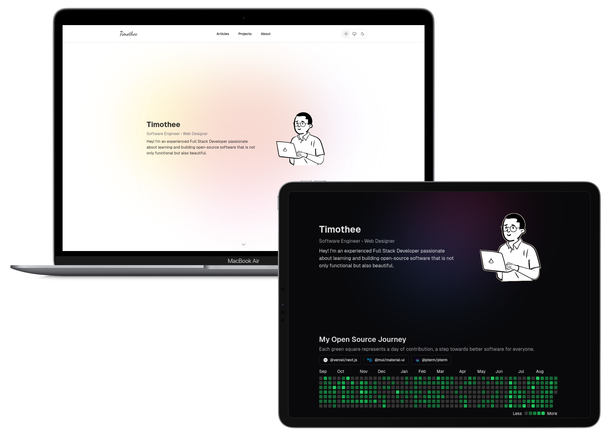

# Ethereal

## Description

Ethereal is my personal website and blog as of September 2024. All code written is free to use and modify, but please give credit where credit is due. The website is built using TypeScript, Next.js, and Tailwind CSS.

## Features

- **Dark Mode**: Toggle between light and dark mode.
- **Advanced Theming**: Easily switch between 10000+ Shadcn themes and 53 Shiki themes.
- **Syntax Highlighting**: Code blocks are highlighted using Shiki **in build time**.
- **Responsive Design**: The website is fully responsive and works on all devices.
- **SEO Optimized**: The website is optimized for search engines, including sitemap and Open Graph tags.

## Stack

- **Language**: TypeScript
- **Framework**: Next.js
- **Styling**: Tailwind CSS
- **Code Highlighting**: Unified (Rehype) + Shiki
- **Components**: Shadcn (Radix UI)

